## Seja bem vindo!!

## Tecnologias

|  |  |  |  |  |
| :--------------------------------------------: | :-----------------------------------------------------: | :-----------------------------------------------------: | :----------------------------------------------: | :-----------------------------------------------: |

|  |  |  |  |
| :-----------------------------------------------: | :------------------------------------------------------: | :------------------------------------------------: | :----------------------------------------------: |

## Projetos em Destaque

## [API do Dota 2](https://github.com/Emerson2342/dota2)

- Procure Jogadores pelo ID;
- Veja as últimas 20 partidas e suas performances;
- Confira os itens dos jogadores da partida;
- Analise a média da performance de cada jogador na partida baseada no herói jogado;
- Veja os heróis jogados nas últimas 20 partidas;

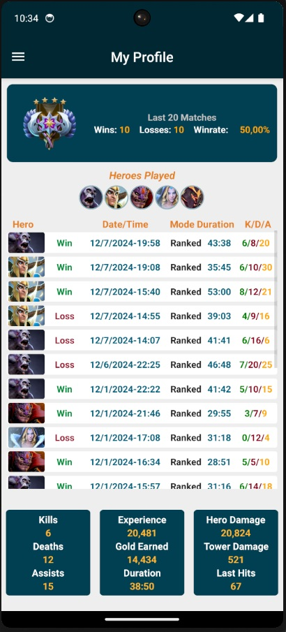 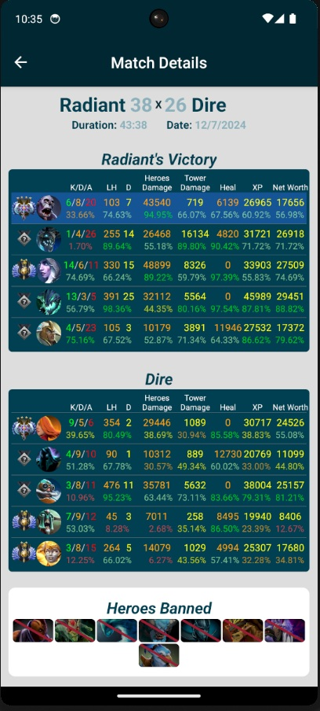 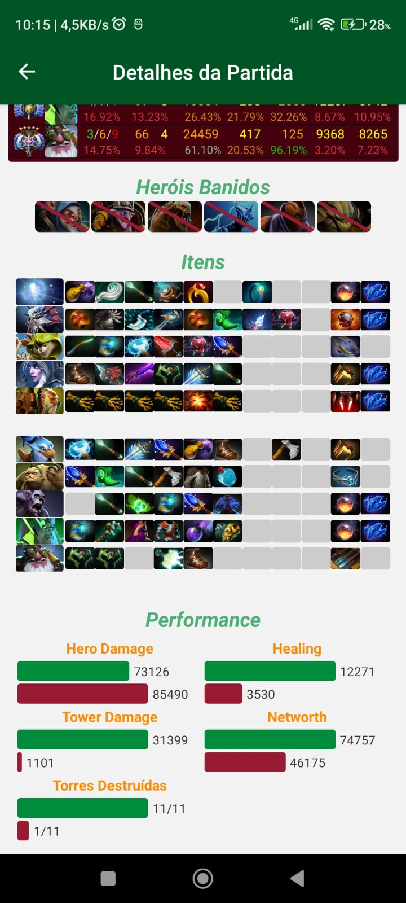

## [Sistema de Tarefas em Blazor Full Stack .NET](https://github.com/Emerson2342/task-api)

- Exercício para solidificar meus conhecimentos no stack .NET;
- Aplicação feita com Blazor Server do .NET;
- Comunicação do backend com front end apenas com endpoints;
- Implementação de Domínios Ricos e autenticação via token, entre outros recursos.

| 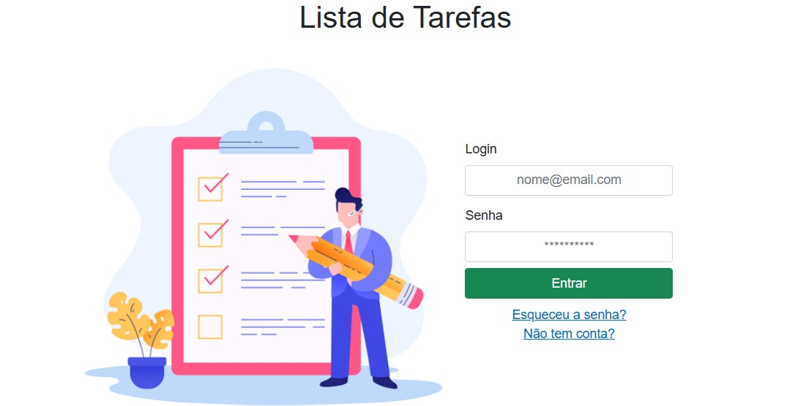 |    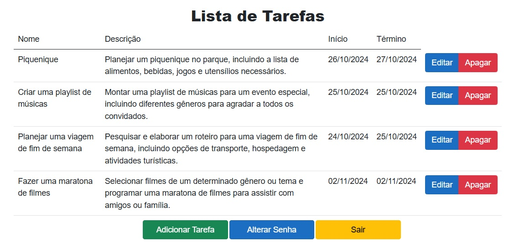    |
| :---------------------------------------------------------------------: | :--------------------------------------------------------------------------: |
| 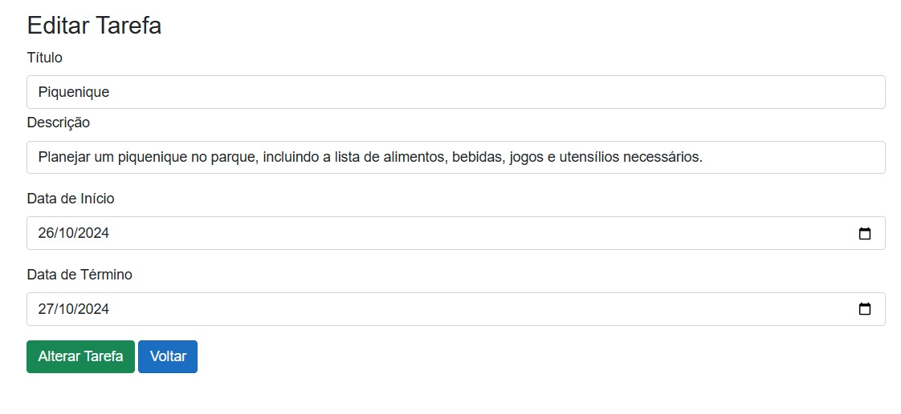  | 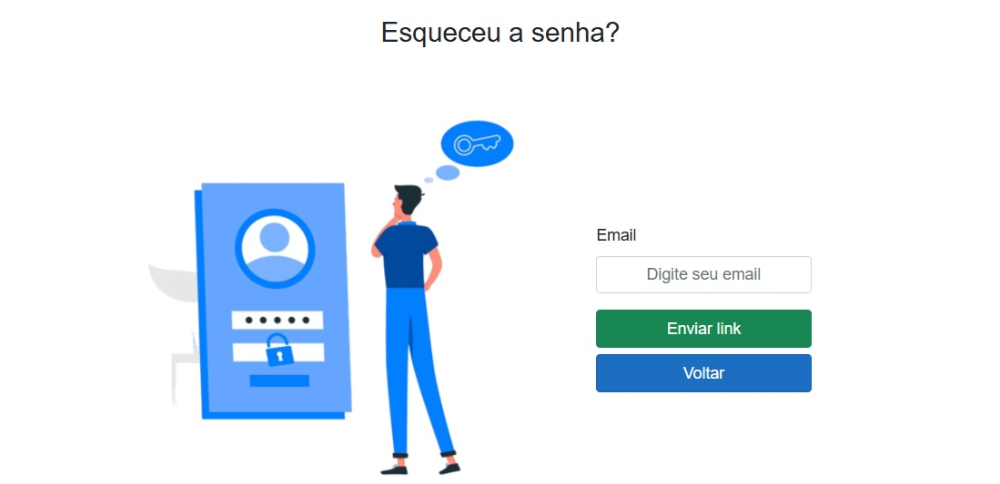 |

## [API de Filmes e Séries](https://github.com/Emerson2342/apI-filmes)

- Veja os filmes e séries atuais em destaque;
- Busque por nome ou gênero;
- Salve-os na lista para lembrar de assistir mais tarde;

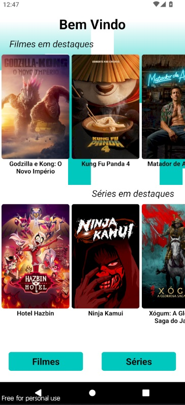 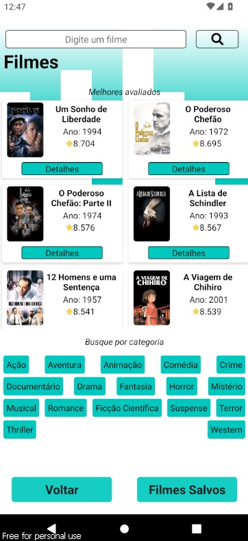 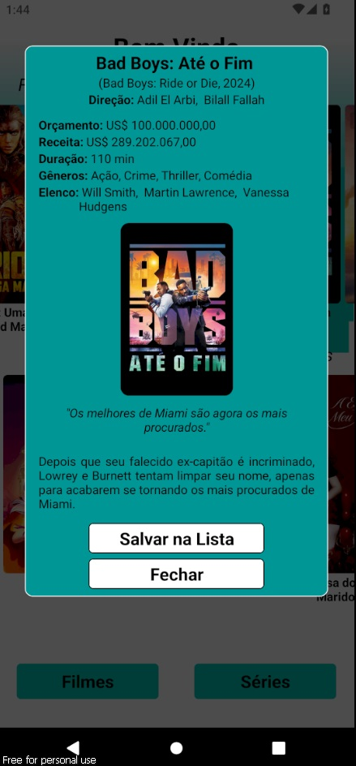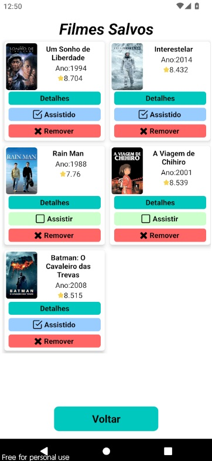

## [Gerenciador de Partidas de Futebol Society](https://github.com/Emerson2342/proxima-futebol)

- Substitua a prancheta pelo celular;
- Sorteie os jogadores antes de cada jogo;
- Marque os gols e assistências para individualmente;

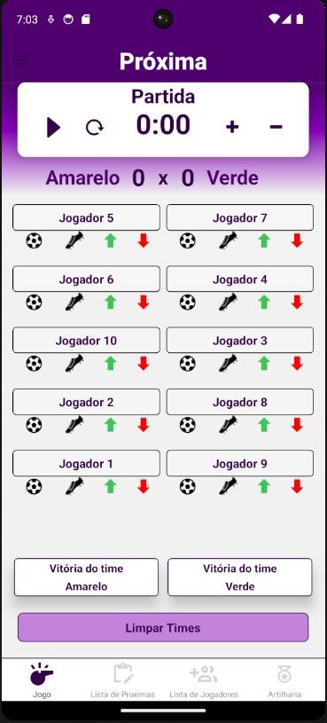 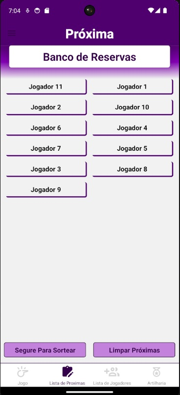 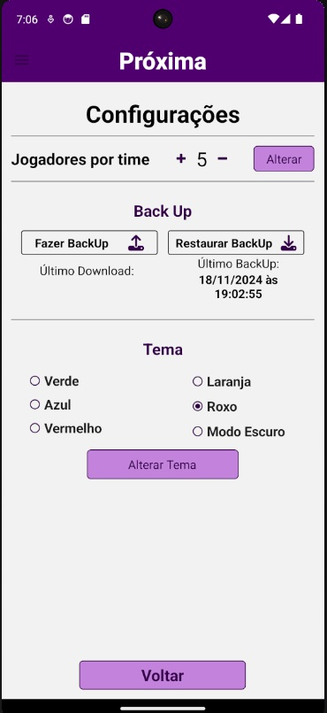 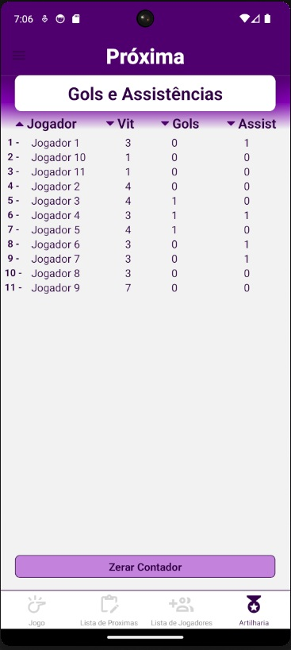

## [Gerenciador de Senhas](https://github.com/Emerson2342/gerador-senha/)

- Customize a criação de senhas com caracteres especiais ou numéricos;
- Salve suas senhas com maior facilidade;
- Aplicativo sem conexão com a internet para evitar invasões;

|  |  |
| :---------------------------------------------------------------------------------------------------------------------------------: | :------------------------------------------------------------------------------------------------------------------------: |
