## Seja bem vindo!!

## 🖥️ Frontend

  

---

## ⚙️ Backend

## Projetos em Destaque

## [Dota 2 Stats: Explore, Analyze (React Native)](https://github.com/Emerson2342/dota2statistics)

<a href="https://play.google.com/store/apps/details?id=com.missinhoo.Dota2" target="_blank" rel="noopener noreferrer">
  
</a

- Procure Jogadores por nome ou ID;
- Veja as últimas 20 partidas e suas performances;
- Confira os itens dos jogadores da partida;
- Analise a média da performance de cada jogador na partida baseada no herói jogado;
- Gráfico minuto a minuto mostrando a diferença de XP e Patrimônio Líquido;
- Salve jogadores numa lista de favoritos;
- Detalhes dos atributos dos heróis;
- Descriçao de habilidades, cetro e aghanim shard dos heróis;
- Veja as últimas partidas e campeonatos profissionais;
- Veja os heróis mais escolhidos e com melhores taxa de vitória;

 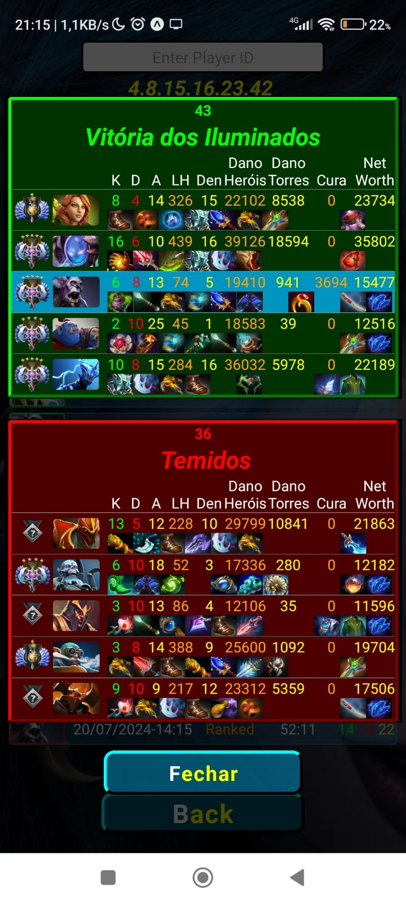 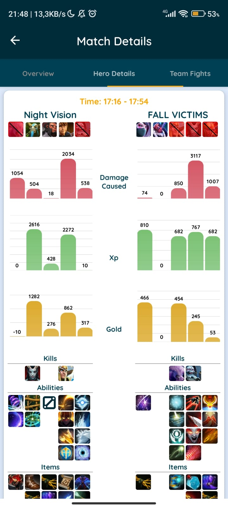 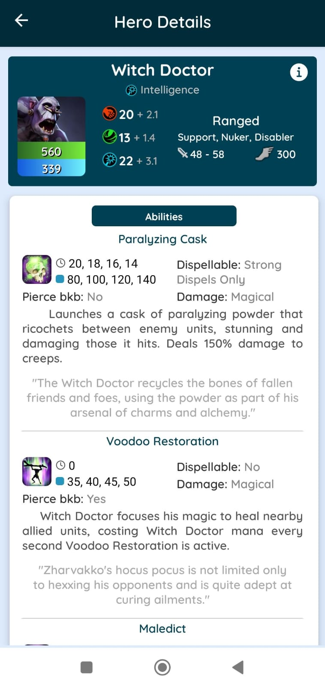>

## [DF Bus (Flutter)](https://github.com/Emerson2342/df-bus)

- Pesquise as linhas de ônibus do Distrito Federal;
- Pesquiser por origem e destino;
- Veja os horários de saída do ponto de origem;
- Veja o percurso completo da linha;
- Acompanhe a localização atual dos ônibus;

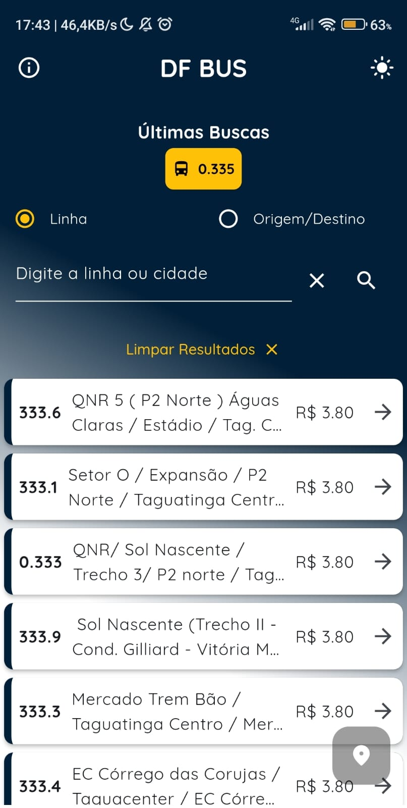 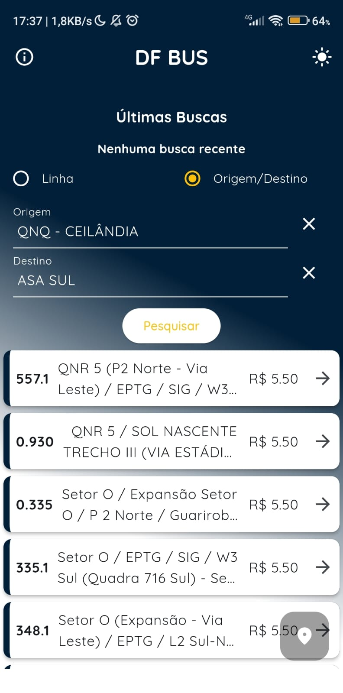 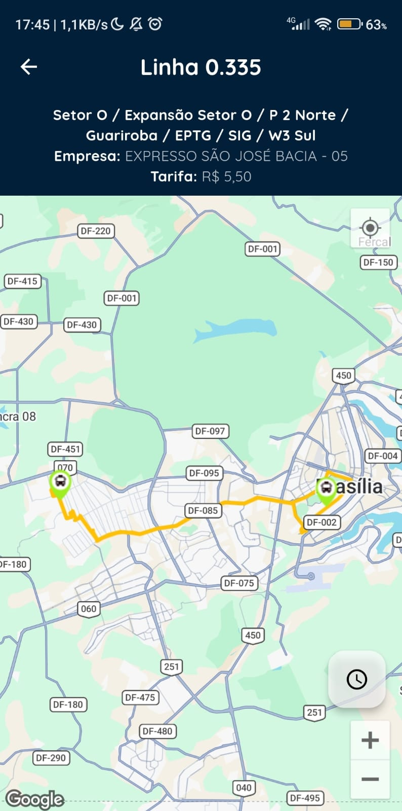 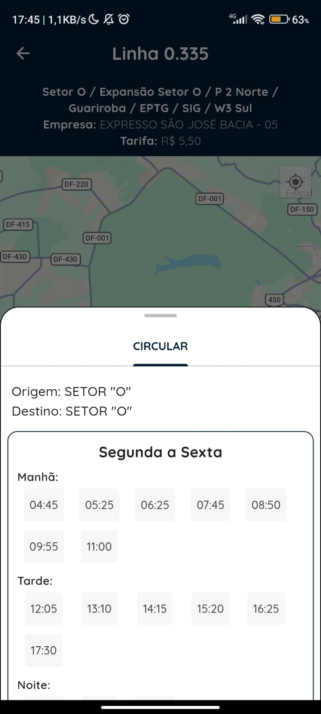

## [Filmes e Séries (Flutter)](https://github.com/Emerson2342/filmes-series)

- Veja os filmes e séries atuais em destaque;
- Busque por nome ou gênero;
- Salve-os na lista para lembrar de assistir mais tarde;

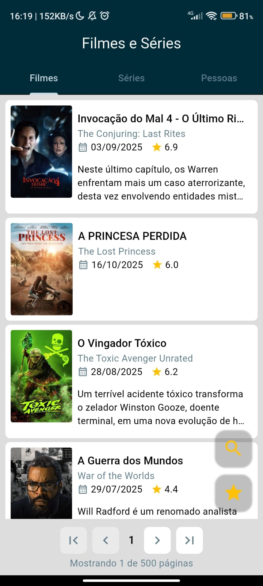  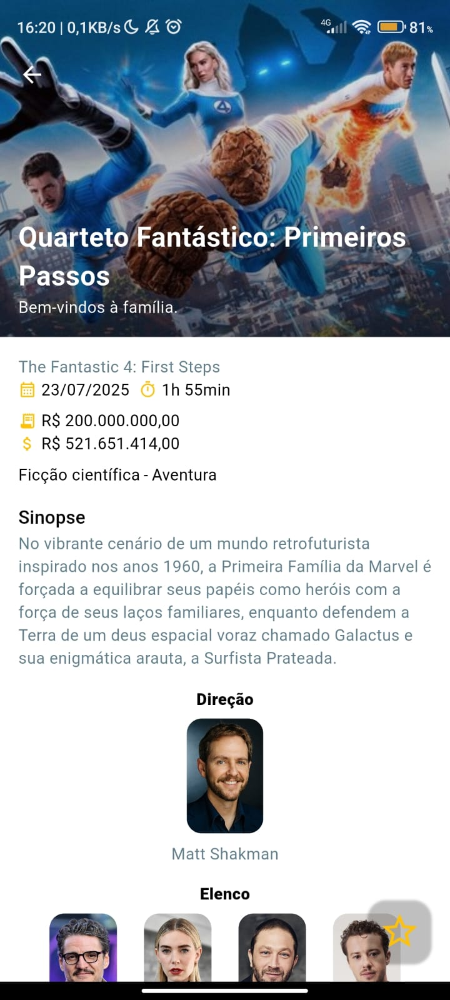 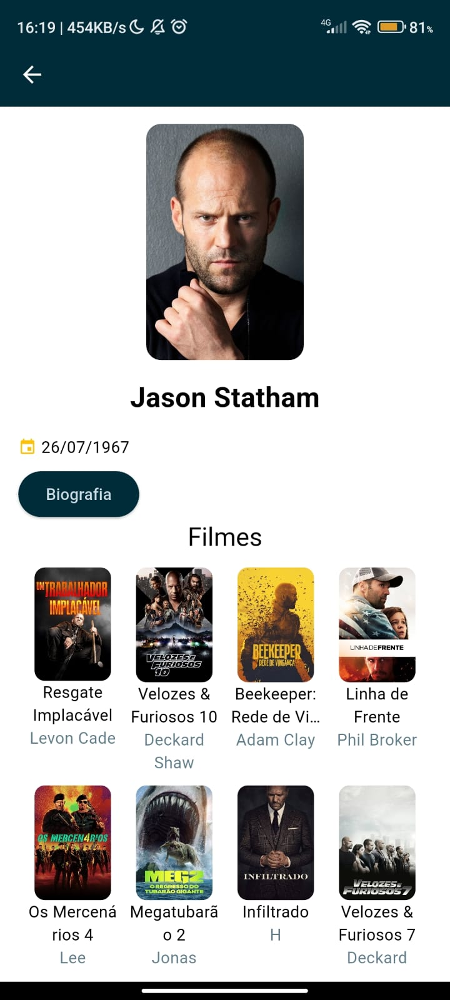

## [Gerenciador de Senhas (React Native)](https://github.com/Emerson2342/passwords)

- Customize a criação de senhas com caracteres especiais ou numéricos;
- Salve suas senhas com maior facilidade;
- Aplicativo sem conexão com a internet para evitar invasões;
- Aplicativo com bloqueio caso o dispositivo tenha senha por impressão digital ou padrão;

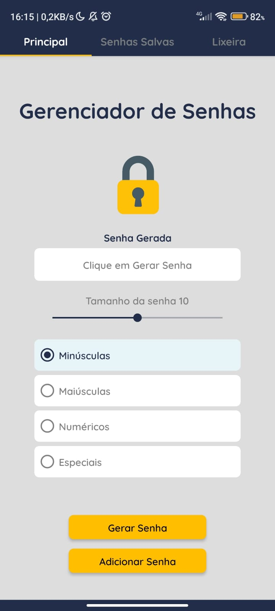 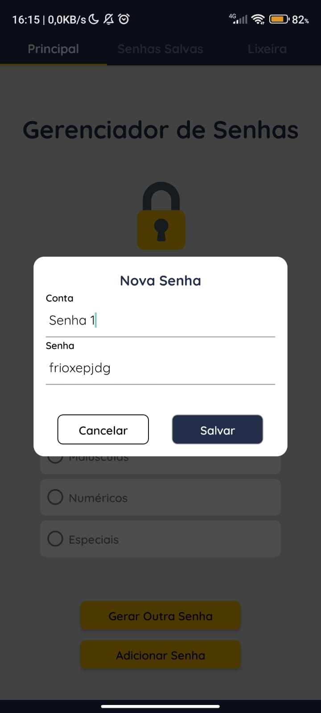 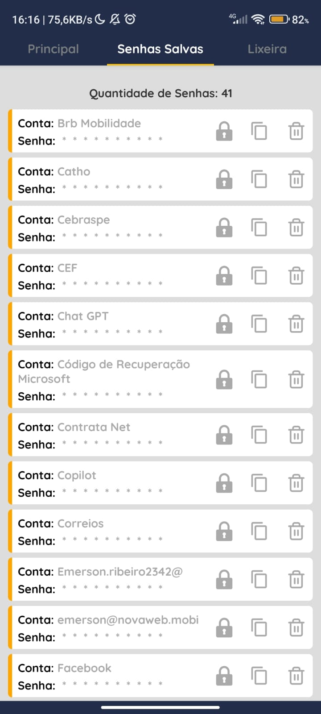 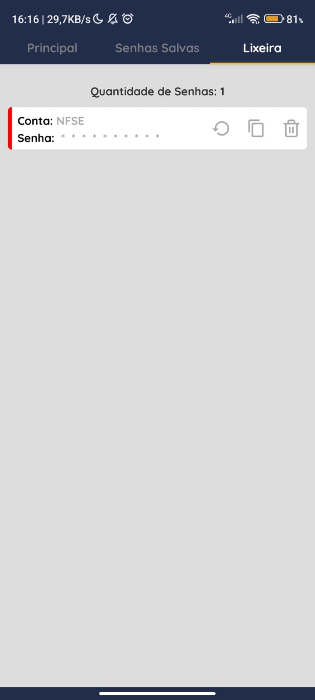

## [Gerenciador de Partidas de Futebol Society](https://github.com/Emerson2342/proxima-futebol)

- Substitua a prancheta pelo celular;
- Sorteie os jogadores antes de cada jogo;
- Marque os gols e assistências para individualmente;

   
