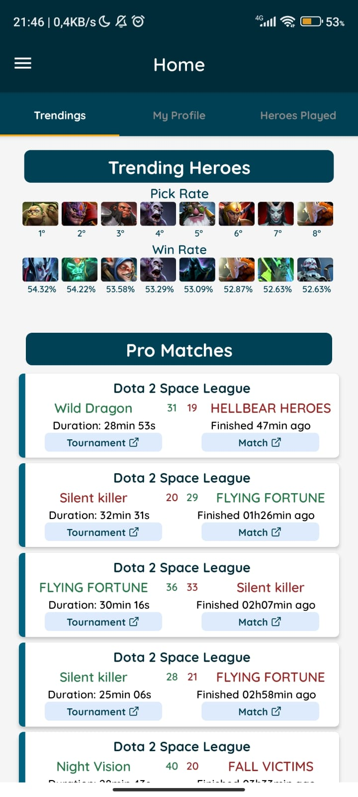
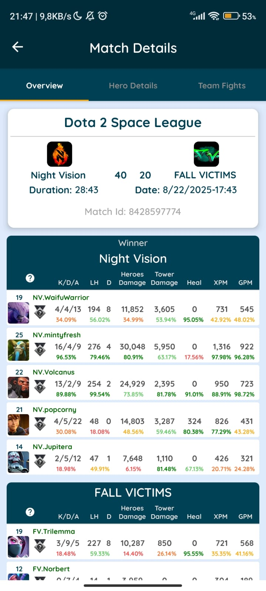

## Seja bem vindo!!

## Tecnologias

|  |  |  |  |  |
| :--------------------------------------------: | :-----------------------------------------------------: | :-----------------------------------------------------: | :----------------------------------------------: | :-----------------------------------------------: |

|  |  |  |  |
| :-----------------------------------------------: | :------------------------------------------------------: | :------------------------------------------------: | :----------------------------------------------: |

## Projetos em Destaque

## [API do Dota 2](https://github.com/Emerson2342/dota2)

- Procure Jogadores pelo ID;
- Veja as últimas 20 partidas e suas performances;

|          |   |
| :----------------------------------------------------------------------: | :-----------------------------------------------------------------: |
|  |  |

## [Gerenciador de Partidas de Futebol Society](https://github.com/Emerson2342/proxima-futebol)

- Substitua a prancheta pelo celular;
- Sorteie os jogadores antes de cada jogo;
- Marque os gols e assistências para individualmente;

|     |     |
| :----------------------------------------------------------------------: | :----------------------------------------------------------------------: |
|  |  |

## [API de Filmes e Séries](https://github.com/Emerson2342/apI-filmes)

- Veja os filmes e séries atuais em destaque;
- Busque por nome ou gênero;
- Salve-os na lista para lembrar de assistir mais tarde;

|           |       |
| :--------------------------------------------------------------------------: | :------------------------------------------------------------------------: |
|  |  |

## [Gerenciador de Senhas](https://github.com/Emerson2342/gerador-senha/)

- Customize a criação de senhas com caracteres especiais ou numéricos;
- Salve suas senhas com maior facilidade;
- Aplicativo sem conexão com a internet para evitar invasões;

|  |  |
| :---------------------------------------------------------------------------------------------------------------------------------: | :------------------------------------------------------------------------------------------------------------------------: |
